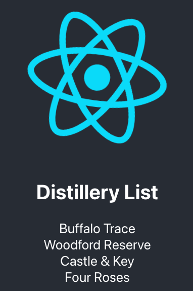

# spring-react

This example app shows how to create a Spring Boot API and CRUD (create, read, update, and delete) its data with a React app.

**Prerequisites:** [Java 17](https://www.jenv.be/) and [Node.js 18+](https://nodejs.org/)

* [Getting Started](#getting-started)
* [Starting API](#starting-api)
* [Starting UI](#starting-ui)
* [Coding Tasks](#coding-tasks)
* [Links](#links)

## Getting Started

To install this example application, run the following commands:

```bash
git clone https://github.com/freemabd/spring-react
cd spring-react
```

## Starting API
```bash
cd spring-react
./gradlew bootRun
```

## Starting UI
```bash
cd app
npm install
npm start
```
Load client app in browser at http://localhost:3000



## Coding Tasks

Completion of Bourbon Distillery Management Application

Objective:
Develop a React/Spring Boot application for managing information on bourbon distilleries. The application should store data related to bourbon 
distilleries, including their name, license number, address, collection of bourbons, and collection of customers. 

#### Bourbon Distillery Information: 
- Name
- License Number
- Address
- Collection of Bourbons
  - Name
  - Type - (options: single barrel, cask strength, wheated, high rye, high corn, small batch)
  - ABV - (Alcohol By Volume Percentage)
- Collection of Customers
  - Name
  - Phone Number

#### Client Application(React):
This client will use a REST API implemented with Spring Boot. This application should allow for all CRUD(create, read, update and delete) 
operations of Bourbon Distilleries, and all it's nested properties. App.js is stubbed out to return all initialized distilleries in H2 database.
Feel free to create any React components necessary to support these requirements. 

#### Rest API(Spring Boot):
Please complete the REST API for this application. It provides a controller, model and jpa repository for starters. Please
add any controllers/models/repositories needed to complete this task. This REST API is using H2 in memory database and uses 
the Initializer class that loads data on startup of the REST API. When running ./gradlew bootRun, notice the output of the Initializer
loading data:
```bash
2024-03-29T10:11:11.893-05:00  INFO 96801 --- [spring-react] [           main] v.o.springreact.SpringReactApplication   : Started SpringReactApplication in 1.639 seconds (process running for 1.813)
BourbonDistillery{id=1, name='Buffalo Trace'}
BourbonDistillery{id=2, name='Woodford Reserve'}
BourbonDistillery{id=3, name='Castle & Key'}
BourbonDistillery{id=4, name='Four Roses'}
```

Please make the application as robust as possible and cover all edge cases. Please document code to help others understand design decisions.
If you add any application dependencies please document and explain why you are including them.

#### Submission
When finished, please create a zip file of spring-react directory and email to: brian.d.freeman@vumc.org

## Links

This example uses the following open source libraries:

* [React](https://reactjs.org/)
* [Spring Boot](https://spring.io/projects/spring-boot)
